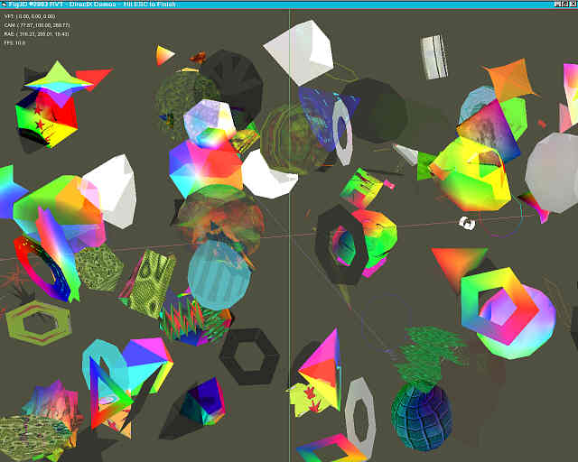



## Fig3D

### Description

Give your Gfx card a real workout. A DirectX8 scene manager with demos. Lights, camera and action for a wide range of 3D figures, you determine what they do and what they look like. The supporting engine (rvtDX.dll) in this archive. A good further tutorial in DirectX8. Obviously needs DX8 on your machine. (333k)
 
### More Info
 
Teaches basically how DX8 can/should be used. Some knowledge of vector maths useful. 3D visualisation

             |
---                |---
**Submitted On**   |2003-02-05 22:08:04
**By**             |[Ron van Tilburg](https://github.com/Planet-Source-Code/PSCIndex/blob/master/ByAuthor/ron-van-tilburg.md)
**Level**          |Intermediate
**User Rating**    |4.8 (29 globes from 6 users)
**Compatibility**  |VB 6\.0
**Category**       |[DirectX](https://github.com/Planet-Source-Code/PSCIndex/blob/master/ByCategory/directx__1-44.md)
**World**          |[Visual Basic](https://github.com/Planet-Source-Code/PSCIndex/blob/master/ByWorld/visual-basic.md)
**Archive File**   |[Fig3D154005262003\.zip](https://github.com/Planet-Source-Code/ron-van-tilburg-fig3d__1-42987/archive/master.zip)

### API Declarations

Uses DirectX8

